# INFORME PROYECTO 02 - HENRY LABS

## Tabla de Contenido

- [Introducción](#introducción)
- [Objetivos](#objetivos)
- [Stack Tecnológico](#stack-tecnológico)
- [Explicación y Uso del Repositorio](#explicación-y-uso-del-repositorio)
- [Reporte de Análisis](#reporte-de-análisis)
  - [Análisis global de cantidad de víctimas vs variables de tiempo](#análisis-global-de-cantidad-de-víctimas-vs-variables-de-tiempo)
  - [Análisis global de cantidad de víctimas vs variables cualitativas](#análisis-global-de-cantidad-de-víctimas-vs-variables-cualitativas)
  - [Análisis detallado por año cantidad de víctimas vs variables cualitativas (barras apiladas - gráfico de líneas)](#análisis-detallado-por-año-cantidad-de-víctimas-vs-variables-cualitativas-barras-apiladas---gráfico-de-líneas)
  - [Análisis cantidad de víctimas vs variables cualitativas víctimas (bonus)](#análisis-cantidad-de-víctimas-vs-variables-cualitativas-víctimas-bonus)

## Introducción
En este proyecto se asumirá el Rol de Data Analyst con el fin de explorar y analizar los siniestros viales (eventos que involucran vehículos en las vías públicas y que pueden tener diversas causas, como colisiones entre automóviles, motocicletas, bicicletas o peatones, atropellos, choques con objetos fijos o caídas de vehículos) en la Ciudad de Buenos Aires entre el periodo 2016 al 2021, el fin de este proyecto es generar información que sea relevante y tenga un valor agregado para la toma de decisiones asertivas y poder disminur las tasas de siniestros viales y por ende víctimas mortales.

## Objetivos
* Realizar un análisis exploratorio completo de los datos del proyecto.
* Documentar claramente los pasos tomados en el análisis, incluyendo gráficos y visualizaciones relevantes.
* Desarrollar un dashboard funcional e interactivo en power bi que facilite la exploración de datos.
* Incluir filtros en power bi que permitan a los usuarios seleccionar y analizar datos específicos.
* Diseñar el dashboard el power bi de manera clara y estética para facilitar la interpretación de la información.
* Medir y graficar la reducción del 10% en la tasa de homicidios en siniestros viales de los últimos seis meses en CABA en comparación con el semestre anterior.
* Medir y graficar la reducción del 7% en la cantidad de accidentes mortales de motociclistas en el último año en CABA en comparación con el año anterior.
* Proponer, medir y graficar un tercer KPI relevante para la temática de seguridad vial.
* Garantizar que los KPIs estén representados adecuadamente en el dashboard de power bi.

## Stack Tecnológico
El stack tecnológico utilizado para este proyecto fue el siguiente:
* Visual Studio Code (Editor de codigo en donde se manipuló archivos .ipynb para la realización del EDA)
* Las librerias requeridas para el funcionamiento del proyecto las cuales se encuentran detalladas en el archivo requirements.txt de este repositorio.
* Power Bi, la cuál es una herramienta de visualización de datos en donde se realizó el respectivo dashboard con los KPI'S

## Explicación del Repositorio
El repositorio tiene una carpeta llamada "02_Data", ésta carpeta tiene dos archivos, el archivo homicidios.xlsx fue el que se utilizo para el presente proyecto y se encuentra explorado y analizado en el notebook llamado "proyecto02_EDA.ipynb" el cuál sera abordado en profundidad en el siguiente apartado "Reporte de Análisis". Esta carpeta también tiene otro archivo llamado "lesiones.xlsx" el cual se deja como opcional para un desarrollo posterior.

## Reporte de Análisis
### Análisis global de cantidad de víctimas vs variables de tiempo
* **Víctimas por año:** En este apartado se muestra el total de víctimas mortales entre el 2016 al 2021 desglosado por años en una gráfica de barras en donde se identifica que la cantidad de víctimas mortales en los ultimos tres años (2019-2021) decreció considerablemente respecto a los ultimos tres años anteriores (2016-2018). Pero si analizamos el ultimo año las víctimas mortales han aumentado.

    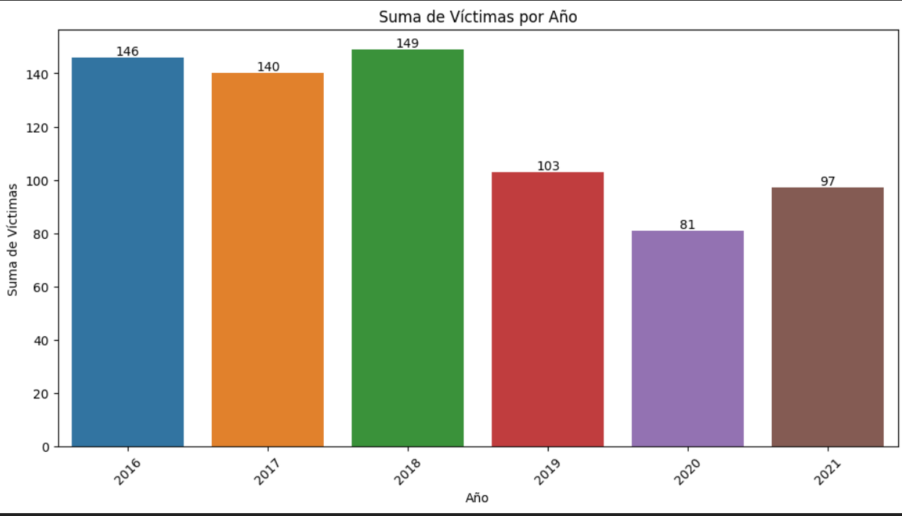

    Adicionalmente se realiza un grafico de lineas para calcular la tasa de crecimiento o decrecimiento en cuanto a la cantidad de víctimas mortales con respecto al año anterior, en donde se evidencia una fuerte disminución entre el 2018 al 2020 siendo mas pronunciada la disminución en el 2019 pero en contrapartida un fuerte aumento entre el 2020 al 2021.

    

* **Víctimas por mes:** Se muestra la cantidad de víctimas mortales desglosadas por mes y que comprende los cinco años de data que se tienen, mostrando a nivel general que los meses con mayor número de víctimas mortales son los meses de agosto, noviembre y diciembre respectivamente, siendo diciembre el mes con mayor cantidad de víctimas, el resto de meses se mantienen constantes entre un rango de 50 a 60 muertes mensuales.

    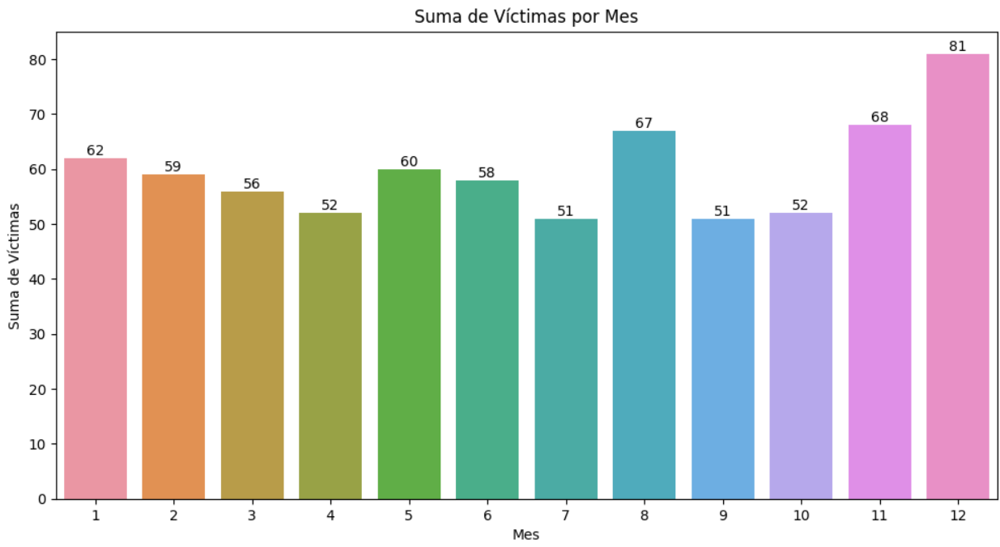

    Se muestra la variación porcentual con respecto al mes anterior y la cantidad de víctimas mortales, se puede observar que hubo una fuerte disminución entre agosto y septiembre pero en contrapartida esa disminución vino acompañada en los ultimos tres meses con aproximadamente una duplicación de victimas mortales como se visualiza en la gráfica.

    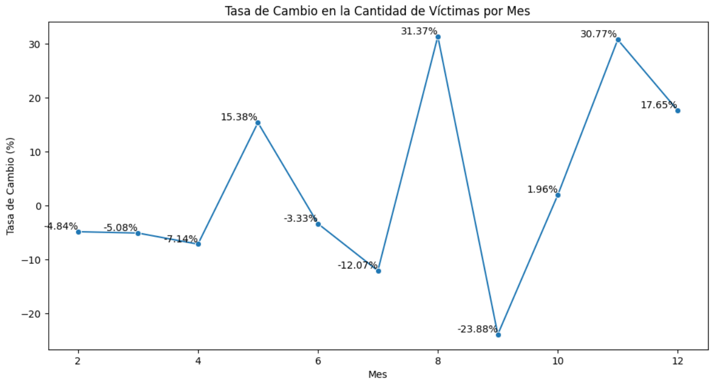

    El siguiente gráfico de lineas muestra la cantidad de víctimas fatales analizadas mes a mes durante todos los años de data (2016-2021), en donde se puede evidenciar que en el mes de diciembre del año 2020 hubo un aumento significativo en la cantidad de víctimas y tambien los últimos dos meses del año 2021 la curva tiende a la alza.

    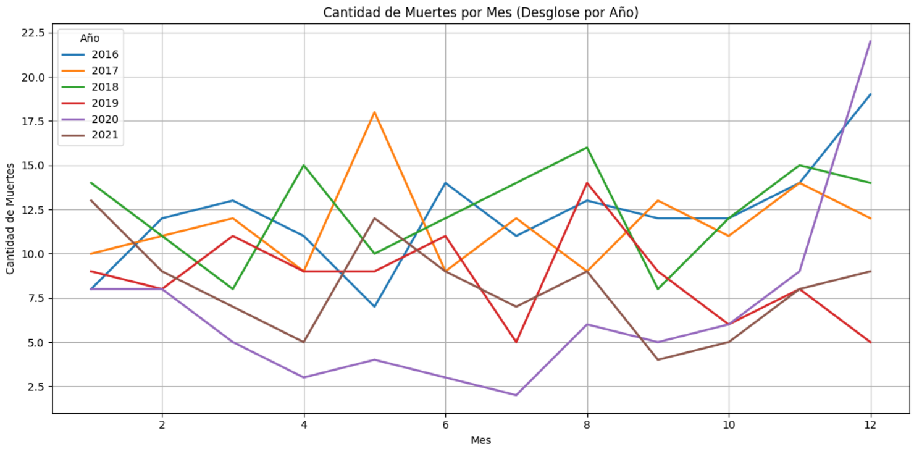

* **Víctimas por día:** En este apartado se realiza el análisis de la cantidad de víctimas mortales por día durante los cinco años mediante un gráfico de barras, se evidencia una fuerte variación en los datos con muchas crestas y valles y que si la representamos en forma de gráfico de lineas va a ser muy parecida a una onda, no sin antes evidenciar que el día con mayor cantidad de muertes es el día 20 de cada mes y los 31 de cada mes el día con menor cantidad de víctimas mortales.

    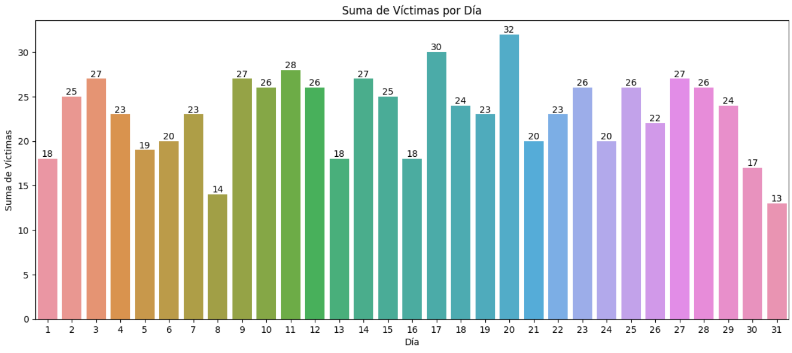

* **Víctimas por franja horaria:** En este apartado se realiza un análisis mediante un gráfico de barras con la cantidad de víctimas mortales respecto a la franja horaria en donde sucedió el accidente, evidenciando que la franja horario con mayor registro de víctimas mortales es entre las 5 a las 7 de la mañana, esto puede ser debido a que a esa hora se presenta la hora pico de tráfico y la mayoría de las personas van rumbo a su trabajo. y las franjas en donde menos ocurren accidentes con víctimas mortales son entre la 1 a las 2 de la tarde (esto puede deberse a que a esa hora muchas personas se encuentran en su horario de almuerzo) y entre las 2 a 3 de la mañana (debido a la poca cantidad de tráfico que hay a esa hora).

    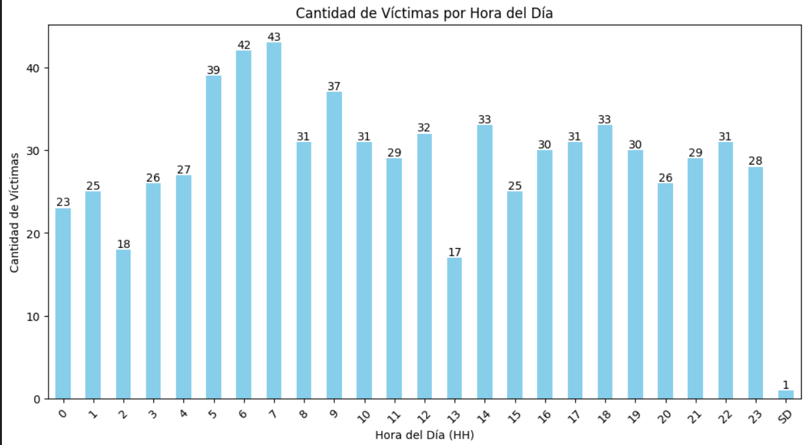

### Análisis global de cantidad de víctimas vs variables cualitativas
* **Víctimas por tipo de calle:** En el siguiente apartado analizamos mediante un gráfico de barras la cantidad de víctimas mortales de acuerdo al tipo de calle en donde ocurrió el accidente, evidenciando que el 61.73% de los eventos ocurrió en una avenida, ahora, si sumamos la GRAL PAZ como avenida podemos notar que el 71.23% de los accidentes ocurrio en una avenida y en donde menos ocurrió accidentes fueron en las autopisas seguidas de las calles con un 9.50% y un 17.27% respectivamente.

    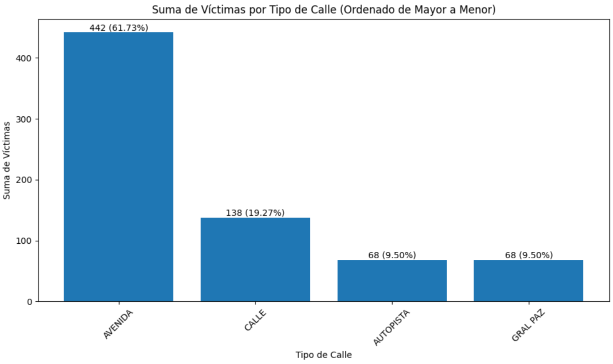

* **Víctimas por Comuna:** En este apartado se analiza la cantidad de víctimas mortales por comuna evidenciando que las comunas 1, 4, 9, 8 y 7 aportan aprox el 50% de víctimas mortales siendo la 1 y la 4 las comunas críticas con un 12.99% y 11.03% respectivamente y las comunas en donde menos se presentan víctimas mortales son en la 6, 5 y 2 respectivamente.

    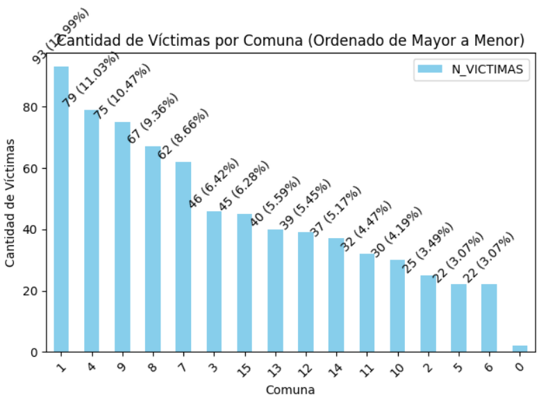

* **Víctimas por tipo de participantes:** En este apartado mediante un gráfico de barras analizamos la cantidad de víctimas de acuerdo a los participantes del accidente, en este caso nos encontramos que el peaton junto con los vehiculos de pasajeros son los que tienen mayor porcentaje de participantes en los accidentes con un 16.33% sobre el total de las victimas siendo el peaton la victima y el vehiculo de pasajeros el acusado, seguido de moto-autos y moto-cargas con un 13.06% y 12.44% respectivamente en donde las victimas son los usuarios de motocicletas tambien con una rúbrica importante.

    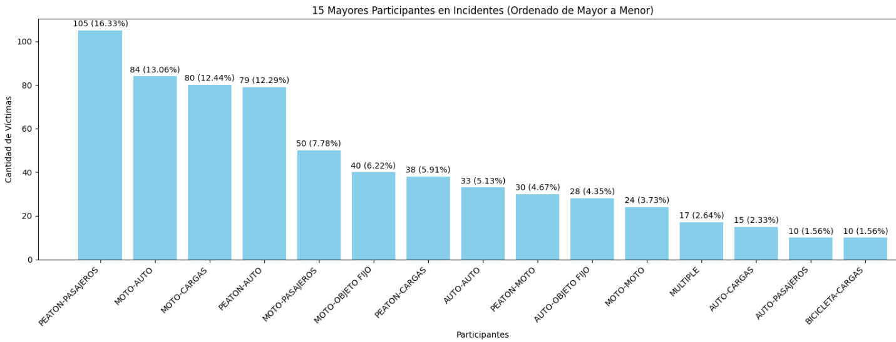

* **Víctimas por Tipo de víctima:** se analiza el porcentaje y cantidad de víctimas de acuerdo al tipo de víctima, corroborando que los motociclistas son los que mayor porcentaje de participación tienen con un 42.04% sobre el total, seguido y con una participación muy importante el peaton con un 37.15%, es decir tan solo estos dos tipos de victima aportan un 79.19% de victimas fatales lo que conlleva a analizar en profundidad las situaciones de estas dos tipos de victimas para reducir estas tasas que en comparación con las demas victimas estan practicamente triplicadas y cuadruplicadas respectivamente.

    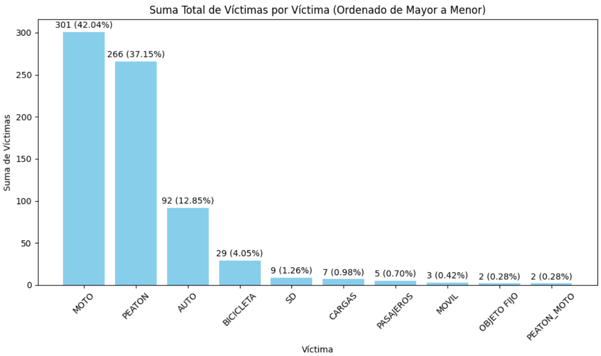

* **Víctimas por Tipo de acusado:** En el siguiente gráfico evidenciamos que los principales acusados durante los accidentes con víctimas fatales son los autos, vehículos de transporte público y cargas aportando un total de 29.33%, 24.86% y 20.95% respectivamente para un total de 75.14%

    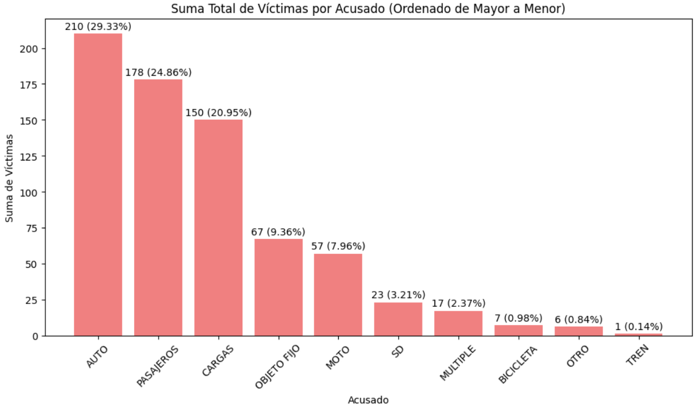

### Análisis detallado por año cantidad víctimas vs variables cualitativas (barras apiladas - gráfico de lineas)

* **Víctimas por año de acuerdo a franja horaria:** En este gráfico de barras apiladas podemos evidenciar el porcentaje de víctimas fatales por franja horaria desglosado por años y seleccionando las 5 categorías con mayor participación para un análisis mas detallado en donde no se encuentra un patron claro pero si la variación que tuvo cada una de las 5 categorías mas importante en los últimos 5 años. 

    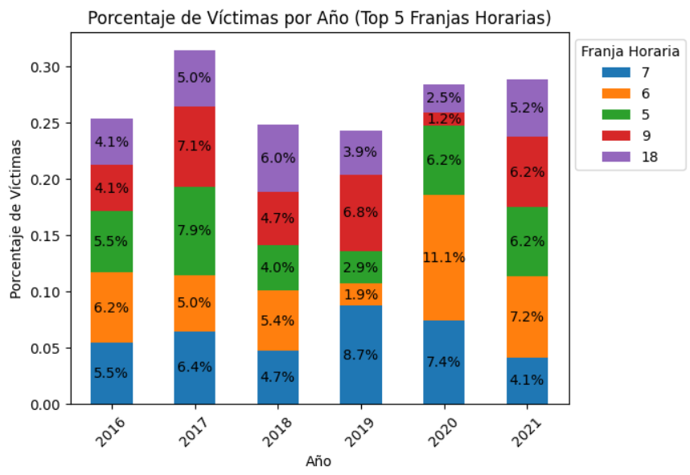

* **Víctimas por año de acuerdo a la comuna:** En este gráfico de barras apiladas y lineas podemos evidenciar el porcentaje de victimas fatales de acuerdo a la comuna desglosado por años para un análisis mas detallado y dejando las 5 categorias con mayor participación. por ejemplo se evidencia que la comuna 1 que fue en donde evidenciamos en nuestro gráfico de barras con mas víctimas mortales a disminuido paulatinamente con el pasar de los años aproximadamente un 6% y la comuna 4 por el contrario aumento exponencialmente el ultimo año.    

    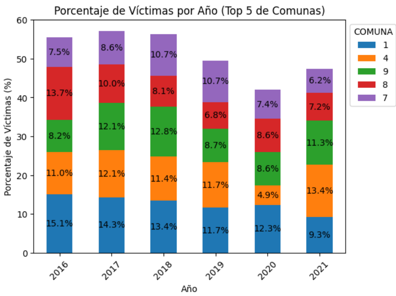

    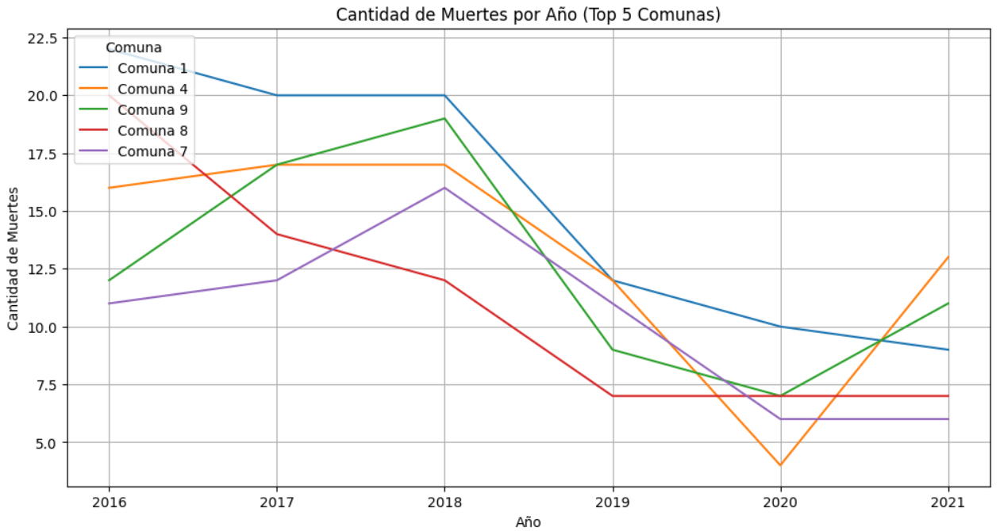

* **Víctimas por año de acuerdo al tipo de calle:** En este gráfico de barras apiladas podemos evidenciar el porcentaje de victimas fatales de acuerdo al tipo de calle en donde ocurrieron los accidentes desglosado por años para un análisis mas detallado, evidenciamos por ejemplo que para el caso de las avenidas ha permanecido constante en el transcurso de los 5 años y las calles tambien han permanecido en un valor constante pero presentando una disminución con respecto al último año del 9% aprox.

    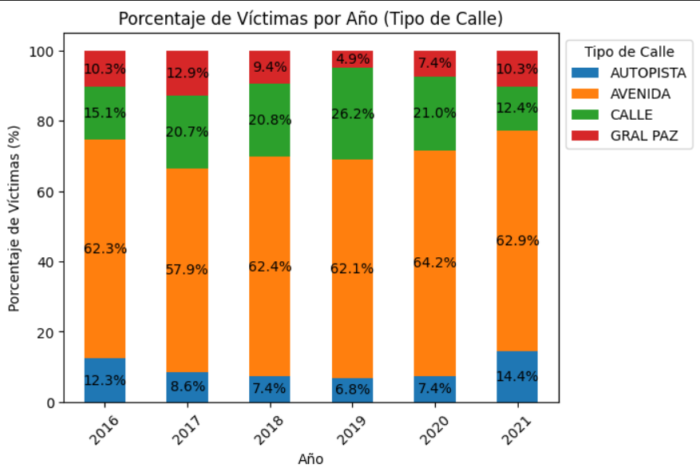

* **Víctimas por año de acuerdo a los participantes:** En este gráfico de barras apiladas podemos evidenciar el porcentaje de víctimas fatales de acuerdo a los participantes en los accidentes desglosado por años para un análisis mas detallado. Se puede evidenciar que para la categoría mas grande en este caso peaton-pasajeros ha sido muy variable pero la tendencia es a la baja ya que si comparamos el 2021 con el 2016 hay una disminución aproximadamente del 5%

    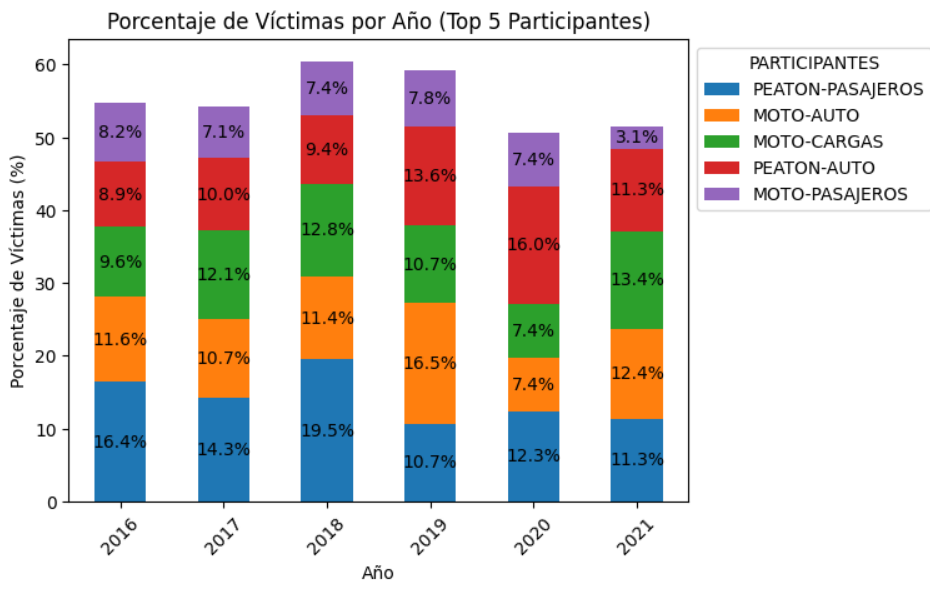

    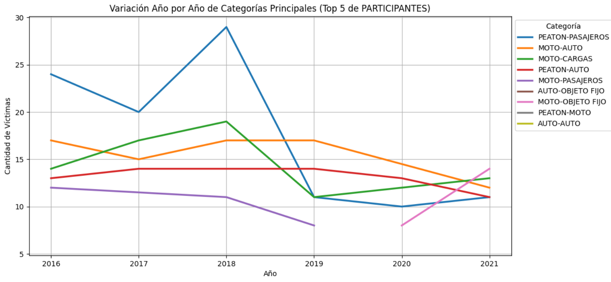

* **Víctimas por año de acuerdo al tipo de víctima:** En este gráfico de barras apiladas podemos evidenciar el porcentaje de víctimas fatales de acuerdo al tipo de víctima en los accidentes desglosado por años para un análisis mas detallado. Podemos evidenciar por ejemplo en el caso de las motos a pesar de que su tendencia ha sido a la baja, en el último año ha aumentado aprox. un 64%, en el caso de la segunda categoría mas grande que es el peaton ha logrado un equilibrio en los últimos tres años pero aún con una tasa de participación muy alta.

    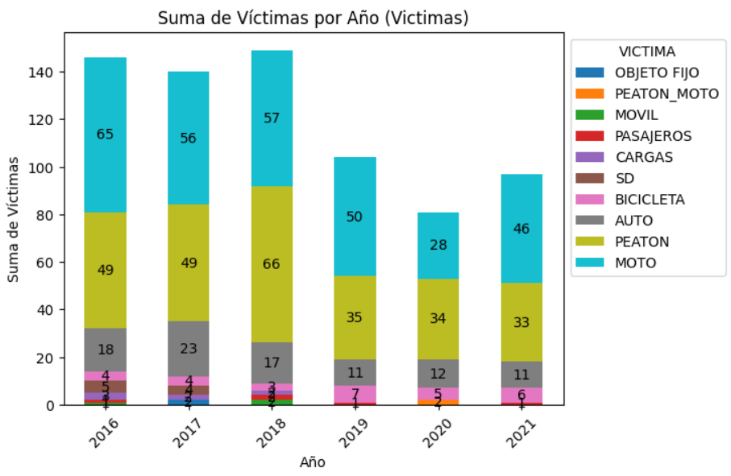

    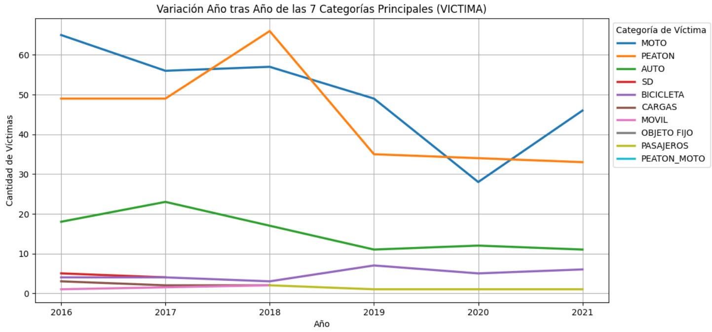

* **Víctimas por año de acuerdo al tipo de acusado:** En este gráfico de barras apiladas podemos evidenciar el porcentaje de víctimas fatales de acuerdo al tipo de acusado en los accidentes desglosado por años para un análisis mas detallado. Por ejemplo para la categoría auto que es la que mayor cantidad de víctimas fatales proporciona se analiza una tendencia a la baja en los últimos 6 años pero el último año ha aumentado levemente, la categoría pasajeros que es el transporte público basicamente si ha logrado una reducción considerable tomando de base tanto el primer año de análisis como el último año y la categoría cargas si se ha mantenido muy variable en los último seis años teniendo picos y valles no tan pronunciados.

    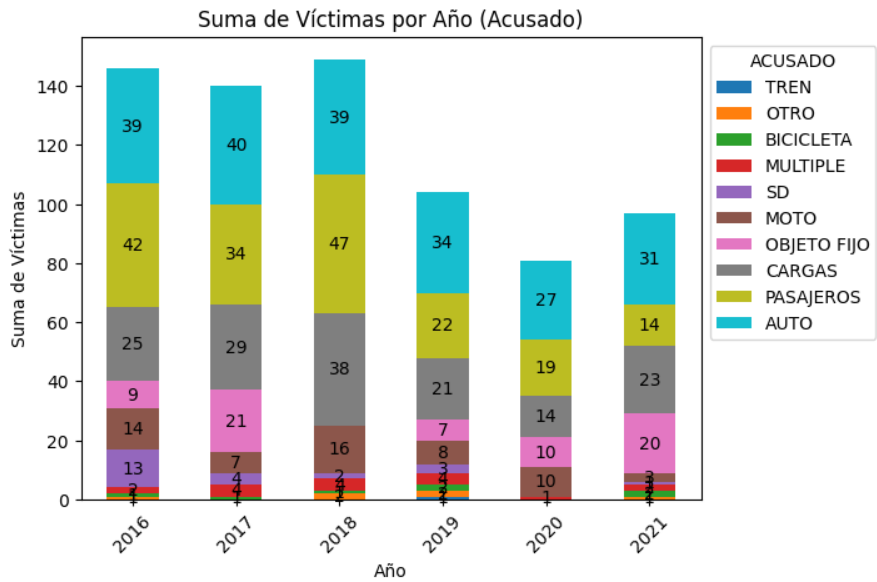

    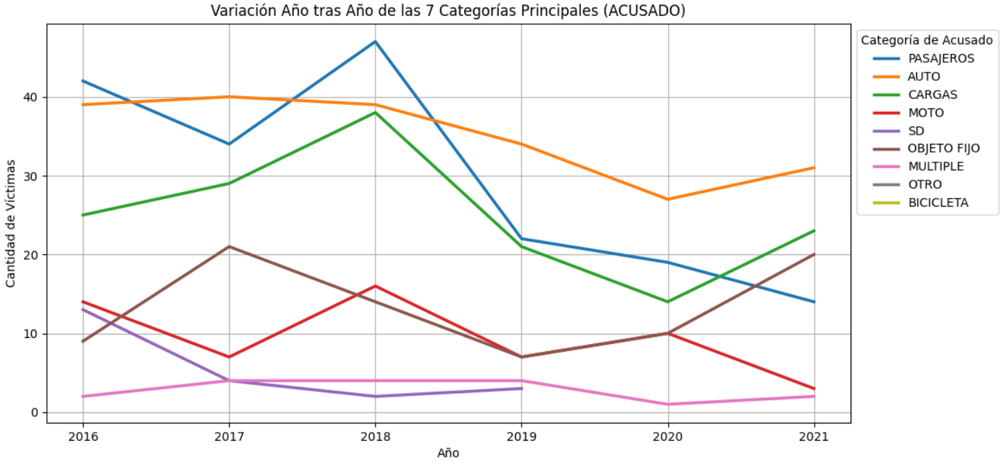

### Análisis relacion cantidad víctimas vs variables cualitativas 

### Análisis cantidad víctimas vs variables cualitativas víctimas (Complementario)

* **Víctimas mortales de acuerdo al rol que desempeñaba:** Este gráfico de barras nos muestra la cantidad de víctimas mortales de acuerdo a su rol en el accidente, evidenciando que cerca al 50 % de los roles que desempeñaba la victima era el de conductor, seguido del peaton con una couta de participación tambien alta, un 37.24%  y ya en un escalón muy por debajo se encuentra el pasajero_acompañante con un 11.16% de participación.

    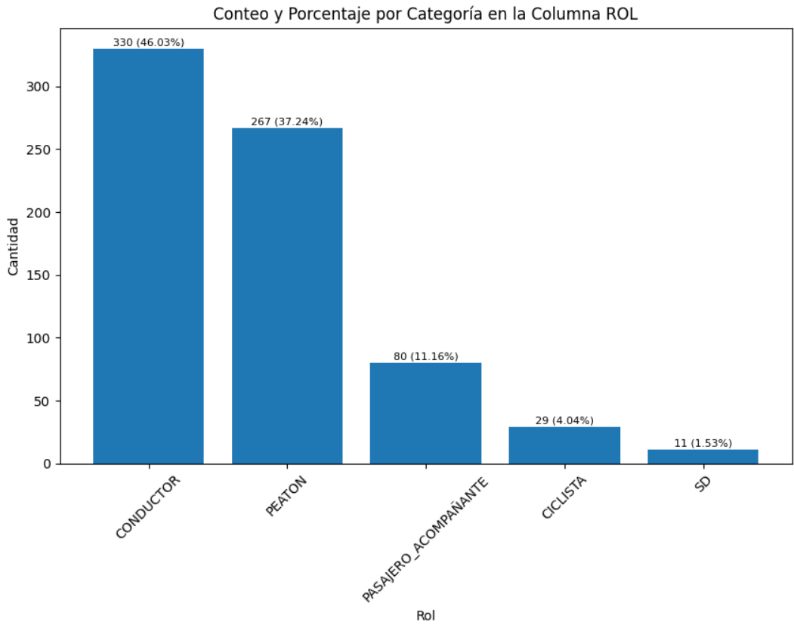

    Ahora se realiza un gráfico de lineas para analizar el comportamiento de cada uno de estos roles durante todos los años analizados, evidenciando que el rol de peaton en los últimos dos años tiende a la baja y normalización mientras que las victimas en el rol de conductor si bien estuvo tambien a la baja entre el 2016 al 2020 el último volvió a aumentar considerablemente.

    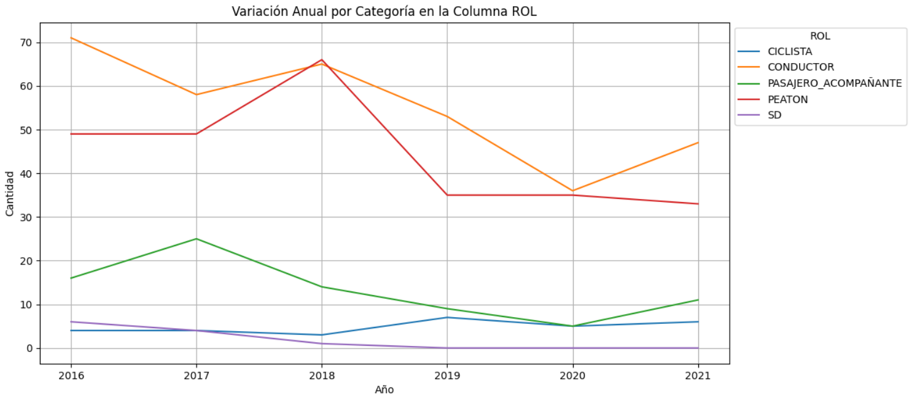

* **Víctimas mortales de acuerdo al tipo de víctima:** Este gráfico de barras nos muestra la cantidad de víctimas mortales de acuerdo al tipo de víctima, evidenciando que los motociclistas y el peaton tienen una cuota de aprox el 80% entre los dos con 42.26% y 37.24% respectivamente seguidos de los autos y las bicicletas.

    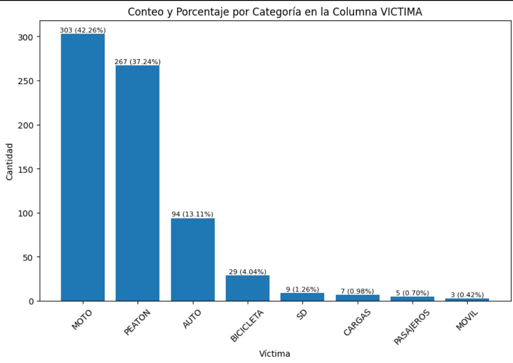
    
    Ahora se realiza un gráfico de lineas para analizar el comportamiento de cada uno de estas categorias en el transcurso de todos los años analizados, evidenciando que la categoría de peaton en el ultimo año tiende a la baja y normalización mientras que la categoría moto estuvo en crecimiento en el último año.

    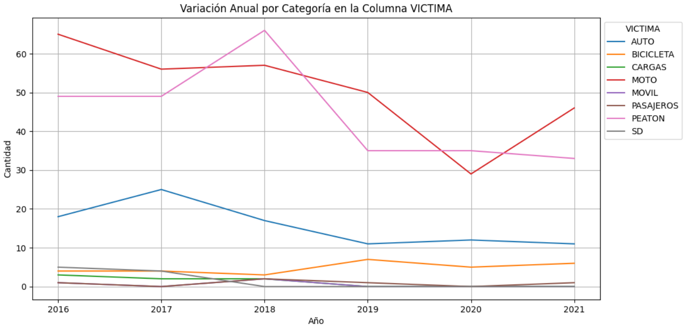

* **Víctimas mortales de acuerdo al sexo:** 
En el siguiente gráfico de barras evidenciamos que el sexo masculino sobrepasa con creces en cuanto a víctimas mortales al género femenino, con una cuota del 76% mientras contra un 23.15% del género femenino, aproximadamente la cantidad de víctimas masculinas se triplica con respecto a víctimas femeninas.

    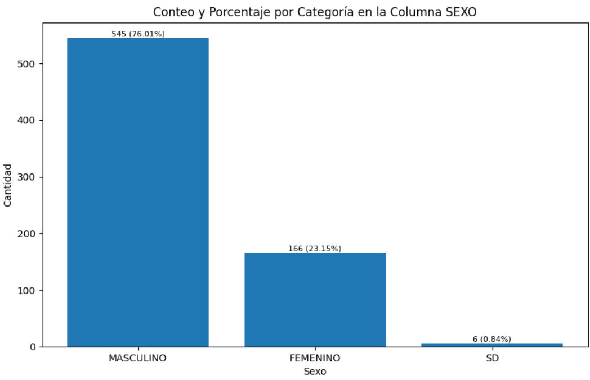

    E igualmente se realiza un gráfico de lineas para analizar su comportamiento a lo largo de los 6 años de estudio mostrando casi una curvatura identica tanta el genero femenino como masculino y con un leve aumento de los dos generos en el último año.

    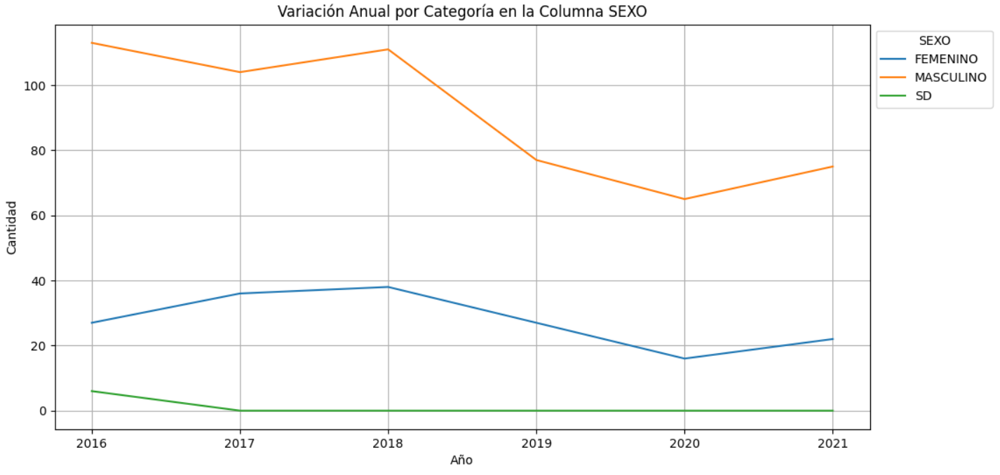
    
* **víctimas mortales de acuerdo a un rango de edad:** En este apartado realizamos un gráfico para analizar las víctimas fatales de acuerdo a un rango de edad evidenciando que aproximadamente un 50% de las víctimas fatales estan entre el rango de los 20 a 40 años siendo la categoría 25 a 30 años, la categoría con mayor víctimas, un 13.86%, seguida muy de cerca del rango 20 a 25 con un 13.40%

    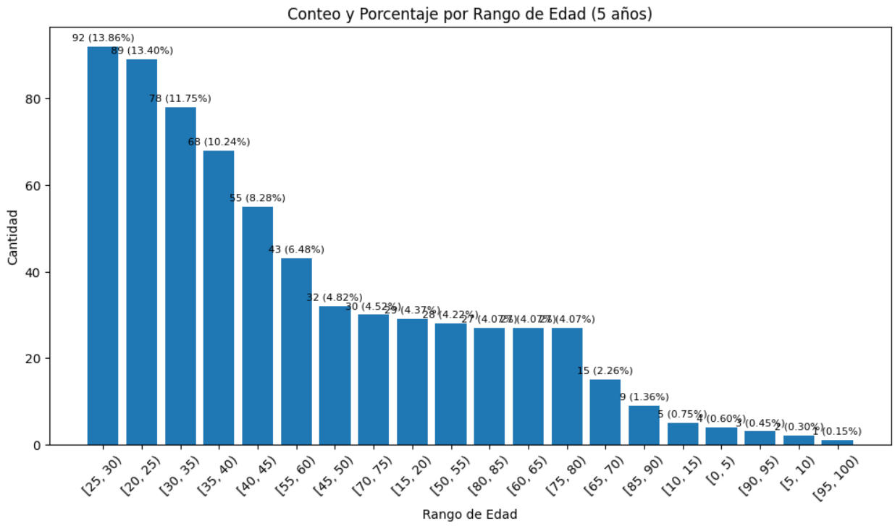

    Adicionalmente y como se hizo en los gráficos anteriores se realizo un gráfica de lineas para analizar su evolucion en el tiempo evidenciando que en el ultimo año 7 de las 10 categorias que se contemplo para el análisis estan en crecimiento.
    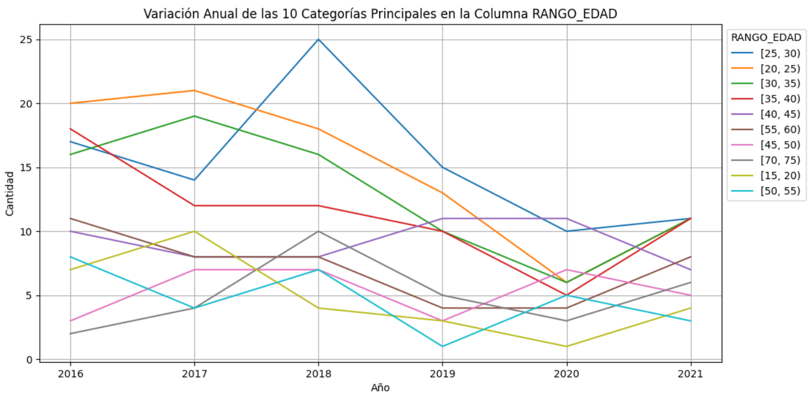

Nota: El archivo de Power Bi con el dashboard será subido al repositorio en una fecha posterior a la presentación del proyecto.

